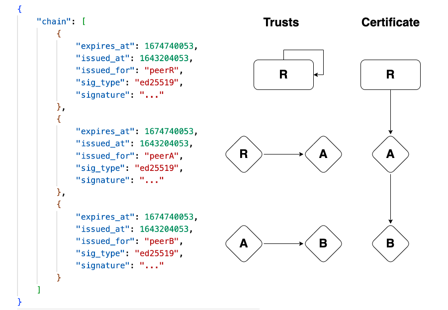
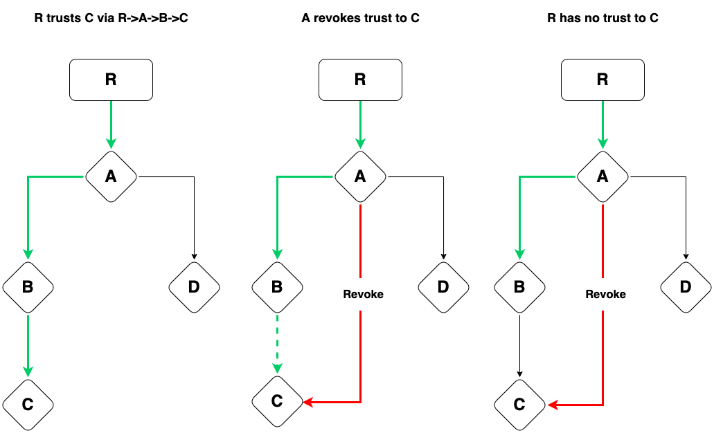
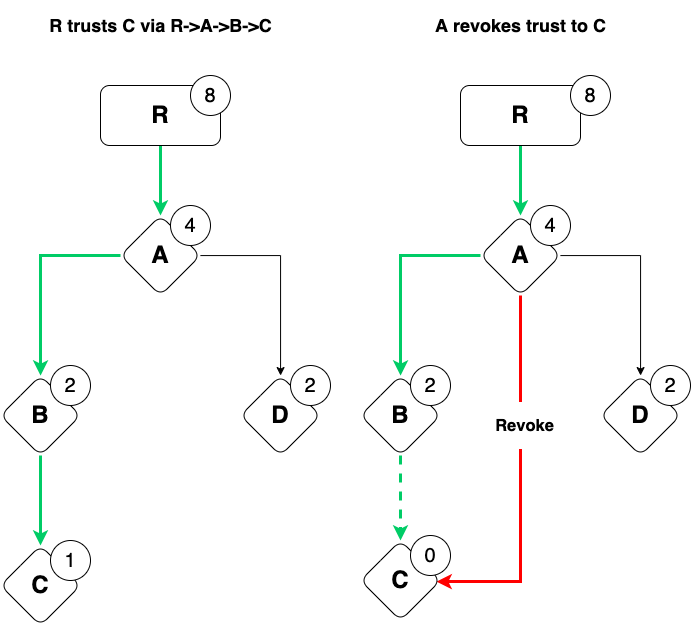

# Trust Graph

- [Trust Graph](#trust-graph)
  - [Overview](#overview)
  - [Why is it important?](#why-is-it-important)
  - [What is it?](#what-is-it)
  - [How to Use it in Aqua](#how-to-use-it-in-aqua)
    - [How to import](#how-to-import)
    - [How to add roots](#how-to-add-roots)
    - [How to issue and add trust](#how-to-issue-and-add-trust)
    - [How to revoke the trust](#how-to-revoke-the-trust)
    - [How to get certificates](#how-to-get-certificates)
    - [How to get weights](#how-to-get-weights)
  - [How to use it in TS/JS](#how-to-use-it-in-tsjs)
  - [Use cases](#use-cases)
    - [Create a trusted subnetwork](#create-a-trusted-subnetwork)
    - [Service permission management](#service-permission-management)
    - [Label trusted peers and execute computation only on this peers](#label-trusted-peers-and-execute-computation-only-on-this-peers)
  - [FAQ](#faq)
  - [API](#api)
  - [Directory structure](#directory-structure)
  - [Learn Aqua](#learn-aqua)

## Overview
The problem of access control and permissions is solved with centralized CAs (Certificate Authority) in web 2.0. However, this problem is urgent and becomes even more challenging considering a decentralized nature of web 3.0. TrustGraph is our point of view on the solution for this challenge.

TrustGraph is a bottom layer of trust for open p2p networks: every peer may be provided with SSL-like certificates that promoted over the network. Service providers and peers can treat certificate holders differently based on their certificate set.

TrustGraph is a basic component that allows storing and managing certificates without additional logic about how to decide whom to trust and whom to treat as unreliable.

## Why is it important?

The problem of peer choice and prioritization is very urgent in p2p networks. Without trust to any network participant, we can't use the network reliably and predictably. Also we should mark and avoid malicious peers. In addition we need to control our application access and permissions in runtime so it performs continuously without interruption and redeployment.

## What is it?

TrustGraph is basically a directed graph with at least one root, vertices are peer ids, and edges are one of the two types of cryptographic relations: trust and revocation.

**Root** is a peer id that we unconditionally trust until it is removed, and is defined by the node owner. Every root has characteristics that represent the maximum length for a chain of trusts.

As a **path to the root**, we consider a path with only trust edges, given this rule: chain `R -> A -> ...-> C` is not a path if A revoked C.

**Trust** is a cryptographic relation representing that peer A trusts peer B until this trust expires or is revoked. Trust relation is transitive. If peer A trusts peer B and peer B trusts peer C, so it results that peer A trusts peer C transitively. Trust relation means that you trust to connect, compute or store based on your business logic and chosen metrics. For example, you want to perform some computation and some well-known peers do that, and are trusted by others you trust, so you can safely use them for computing but not to store sensitive information (personal keys, etc).

Trust data structure contains the following fields:
- peer id, trust is issued to
- creation timestamp
- expiration timestamp
- a signature of the issuer that contains all of previous fields signed

So the trust is signed and tamperproof by design.

**Certificate** is a chain of trusts started with a self-signed root trust. Considering Trust and Certificate data structures, it is possible to track the chain of trust relations: the `issued_for` field of the first trust in a chain indicates a root peer id, second — whom root trusts, etc. So if we have a chain `R->A->B->C` in the certificate it looks like a chain of the following trusts: `R->R`, `R->A`, `A->B`, `B->C`. A certificate is tamperproof since it is a composition of signed trusts.



So peerA is trusted by peerB if there is a path between them in the instance of TrustGraph. The selection of certificates is subjective and defined by a node owner by choice of roots and maximum chain lengths. For now, there are no default metrics for a general case.

**Revocation** is a cryptographic relation representing that a peer A considers a peer C malicious or unreliable. For example, all chains containing paths from A to C will not be treated as valid. So if A trusts a peer B and B trusts C, a peer A has no trust to C transitively, it would have otherwise.



Every peer has a **weight**. A weight signifies a power of 2 or zero. If there is no path from any root to a peer, given revocations, its weight equals zero. The closer to the root, the bigger the weight. Weights are also subjective and relevant in the scope of a local TrustGraph.



TrustGraph is a builtin meaning that every node is bundled with a TrustGraph instance and predefined certificates.

Trust is transitive in terms of cryptographic relations. On the other hand, a subset of trusts and certificates is subjective for each network participant because of the choice of roots.


## How to Use it in Aqua
### How to import
```
import "@fluencelabs/trust-graph/trust-graph-api.aqua"
import "@fluencelabs/trust-graph/trust-graph.aqua"

func my_function(peer_id: string) -> u32:
   on HOST_PEER_ID:
       result <- get_weight(peer_id)
   <- result
```

### How to add roots
- `set_root(peer_id: PeerId, max_chain_len: u32) -> SetRootResult`
- `add_root_trust(node: PeerId, peer_id: PeerId, max_chain_len: u32) -> ?Error`

Let's set our peer id as a root on our relay and add self-signed trust:
```rust
func set_me_as_root(max_chain_len):
  result <- add_root_trust(HOST_PEER_ID, INIT_PEER_ID, max_chain_len)

  -- if you use peer_id different from INIT_PEER_ID
  -- you should add keypair in your Sig service
  if result.success:
     -- do smth
     Op.noop()
  else:
     -- handle failure
     Op.noop()
```
- also you can use `set_root` + `add_trust` to achieve the same goal
- [how to add keypair to Sig service](https://doc.fluence.dev/docs/fluence-js/3_in_depth#signing-service)
- roots can be added only by the service owner
- `max_chain_len` specifies a number of trusts in a chain for the root. Zero for chains that contain only root trust.

### How to issue and add trust

- `issue_trust(issuer: PeerId, issued_for: PeerId, expires_at_sec: u64) -> ?Trust, ?Error`
- `import_trust(trust: Trust, issuer: PeerId) -> ?Error`
- `add_trust(node: PeerId, issuer: PeerId, issued_for: PeerId, expires_at_sec: u64) -> ?Error`

Let's issue trust, and import it to our relay:
```rust
func issue_trust_by_me(issued_for: PeerId, expires_at_sec: u64):
  trust, error <- issue_trust(INIT_PEER_ID, issued_for, expires_at_sec)
  if trust == nil:
     -- handle failure
     Op.noop()
  else:
     on HOST_PEER_ID:
        error <- import_trust(trust!, INIT_PEER_ID)
        -- handle error
```


- `add_trust` is a combination of `issue_trust` and `import_trust`
- if you want to issue trust not by `INIT_PEER_ID` check the Sig service [docs](https://doc.fluence.dev/docs/fluence-js/3_in_depth#signing-service)

### How to revoke the trust

- `issue_revocation(revoked_by: PeerId, revoked: PeerId) -> ?Revocation, ?Error`
- `import_revocation(revocation: Revocation) -> ?Error`
- `revoke(node: PeerId, revoked_by: PeerId, revoked: PeerId) -> ?Error`

Let's revoke some peers by our peer id:
```rust
func revoke_peer(revoked: PeerId):
  revocation, error <- issue_revocation(INIT_PEER_ID, revoked)
  if revocation == nil:
     -- handle failure
     Op.noop()
  else:
     on HOST_PEER_ID:
        error <- import_revocation(revocation!)
        -- handle error
```

- `revoke` is a combination of `issue_revocation` and `import_revocation`
- if you want to issue revocation not by `INIT_PEER_ID` check the Sig service [docs](https://doc.fluence.dev/docs/fluence-js/3_in_depth#signing-service)


### How to get certificates

- `get_all_certs(issued_for: PeerId) -> AllCertsResult`
- `get_all_certs_from(issued_for: PeerId, issuer: PeerId) -> AllCertsResult`
- `get_host_certs() -> AllCertsResult`
- `get_host_certs_from(issuer: PeerId) -> AllCertsResult`

Let's get all certificates issued by us to our relay peer id (HOST_PEER_ID):
```rust
func get_certs_issued_by_me() -> AllCertsResult:
  on HOST_PEER_ID:
     result <- get_host_certs_from(INIT_PEER_ID)
  <- result
```
- `get_host_certs` is just an alias for `get_all_certs(HOST_PEER_ID)`
- `_from` calls results contain only certificates with trust issued by `issuer`

### How to get weights
- `get_weight(peer_id: PeerId) -> WeightResult`
- `get_weight_from(peer_id: PeerId, issuer: PeerId) -> WeightResult`

Let's get our weight for certificates which contain trust by our relay
```rust
func get_our_weight() -> ?u32, ?string:
  weight: ?u32
  error: ?string
  on HOST_PEER_ID:
     result <- get_weight_from(INIT_PEER_ID, HOST_PEER_ID)
     if result.success:
        weight <<- result.weight
     else:
        error <<- result.error
  <- weight, error
```

- `get_weight` returns result among all the certificates, on the other hand, `get_weight_from` return certificates containing trust by the issuer only

## How to use it in TS/JS
1. Add `export.aqua` as in Aqua [documentation](https://doc.fluence.dev/aqua-book/libraries#in-typescript-and-javascript)
2. Add the following to your dependencies
   - `@fluencelabs/trust-graph`
   - `@fluencelabs/aqua`
   - `@fluencelabs/aqua-lib`
   - `@fluencelabs/fluence`
   - `@fluencelabs/fluence-network-environment`

3. Import dependencies
  ```typescript
  import * as tg from "./generated/export";
  import { Fluence, KeyPair } from "@fluencelabs/fluence";
  import { krasnodar, Node } from "@fluencelabs/fluence-network-environment";
  ```
4. Create client (specify keypair if you are node owner
[link](https://github.com/fluencelabs/node-distro/blob/main/fluence/Config.default.toml#L9))

  ```typescript
  await Fluence.start({ connectTo: relay /*, KeyPair: builtins_keypair*/});
  ```
5. Add root and issue root trust.
  ```typescript
  let peer_id = Fluence.getStatus().peerId;
  let relay = Fluence.getStatus().relayPeerId;
  assert(peer_id !== null);
  assert(relay !== null);
  let max_chain_len = 2;
  let far_future = 99999999999999;
  let error = await tg.add_root_trust(relay, peer_id, max_chain_len, far_future);
  if (error !== null) {
   console.log(error);
  }
  ```
6. By default, trusts/revocations signed with the client's private key. To sign with different keys see the Sig service [documentation](https://doc.fluence.dev/docs/fluence-js/3_in_depth#signing-service).
  ```typescript
  // issue signed trust
  let error = await tg.issue_trust(relay, peer_id, issued_for_peer_id, expires_at_sec);
  if (error !== null) {
   console.log(error);
  }
  ```

## Use cases

### Create a trusted subnetwork

You can organize a subnetwork with peers trusted by your choice or chosen metrics. So you can treat trusts given by a peer (or a key) as evidence.

Let's consider we have peers A, B and C:
- Choose a peer A as an authority, set it as a root for the local TrustGraphs on all peers
- Issue and put self-signed by peer A trust as a root trust
- Issue trusts by peer A to peer B and peer C and put them on all peers
- So for call `get_weight_from(targetPeer, peerA)` will reflect whether targetPeer is in a subnetwork ABC

### Service permission management

You can specify in runtime who can access service functionality based on the local TrustGraph (certificates, weights). It's possible to check where the proof comes from based on [tetraplets](https://doc.fluence.dev/docs/knowledge_security). For example, only peers that have  a non-zero weight can execute a service function `trusted_call(weight: WeightResult) -> u8`.

So if you want to have service permission management you should follow the steps:
- Pass `WeightResult` from TrustGraph to the function that you need to control:
 ```rust
 ...
 weight_result <- get_weight(INIT_PEER_ID)
 result <- MyService.trusted_call(weight_result)
 ...
 ```
- Inside your service you need to check tetraplets like [this](https://github.com/fluencelabs/registry/blob/main/service/src/misc.rs#L37) to be sure that they are resulted from the local TrustGraph
- Add `INIT_PEER_ID` or another choosen key as a root
- Issue trust to peers that can call this function:
```rust
func grant_access(issued_for: PeerId, expires_at_sec: u64):
  error <- add_trust(INIT_PEER_ID, issued_for, expires_at_sec)
  if error != nil
     -- handle error
```

### Label trusted peers and execute computation only on this peers

See [example](./example):
- How to call [`trust-graph`](./example/index.ts) functions in TS/JS
- Step-by-step description [`README`](./example/README.md)


## FAQ

- Can a weight change during time?
 - If the shortest path to a root changes, in case of trust expiration, importing or revocation, a weight also changes.

- What does a zero weight mean?
  - A zero weight means there is no trust and path from any roots to the target peer.

- How we can interpret a certificate and/or a peer weight?
 - A certificate contains a path from the root to the target peer we are looking for. A weight represents the presence of these certificates and peers' closeness to the root.

- How are weights calculated and based on what feedback?
 - Weights are calculated based on the existence of a chain of trusts from the roots. For example, if we have a root with a maximum chain length equal 4 and have a chain `R -> A -> B -> C`, so the corresponding weights of peers are `8`, `4`, `2`, `1`. Weights are the same if there are no changes in the paths.
 Until we have no metrics, all trust/revocation logic is a TrustGraph user's responsibility.

- How do I set all weights to untrusted and then increase trust in a peer over time?
 - All peers are untrusted by default. Trust is unmeasured, weight represents how far the peer is from the root, the bigger weight, the closer to the root, so if you want to increase the weight of the target peer, you should obtain the trust from the root or peers who are closer to the root than this peer.

- How do I know that other peers are using the same processes to update weights?
 - Weights calculated **locally** based on certificates that contain immutable signed trusts. Weights are subjective and have meaning only locally to this exact peer.

-  Can I start my own instance of a trust graph or is there only a global version available?
  - Every Fluence node is bundled with a builtin TrustGraph instance, but you can change or remove any service you want if you're a node owner.

## API

High-level API is defined in the [trust-graph-api.aqua](./aqua/trust-graph-api.aqua) module. API Reference soon will be available in the documentation.

## Directory structure

- [`src`](./src) is the main project with all trust graph logic

- [`keypair`](./keypair) directory is an abstracted cryptographical layer (key pairs, public keys, signatures, etc.)

- [`service`](./service) is a package that provides `marine` API and could be compiled to a Wasm file. It uses` SQLite` as storage

- [`example`](./example) is a `js` script that shows how to use Trust Graph to label peers

- [`builtin-package`](./builtin-package) contains blueprint, configs and scripts for generation builtin package locally or via CI

- [`admin`](./admin) is a `js` script used to generate `builtin-package/on_start.json` which contains certificates for Fluence Labs nodes

## Learn Aqua

* [Aqua Book](https://fluence.dev/aqua-book/)
* [Aqua Playground](https://github.com/fluencelabs/aqua-playground)
* [Aqua repo](https://github.com/fluencelabs/aqua)
